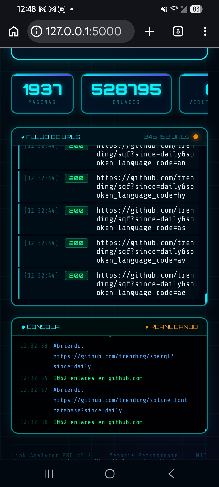
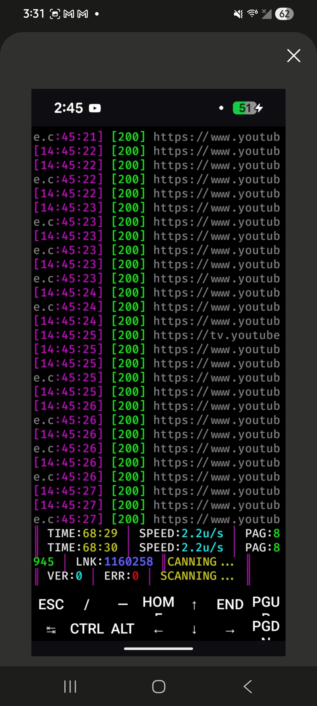

# 🔗 Link Analyzer PRO v5.2

**Motor profesional de crawling, mapeo jerárquico y auditoría de enlaces web.**  
Desarrollado por **Yoandis Rodríguez** · [GitHub](https://github.com/YoandisR) · curvadigital0@gmail.com

---

## ¿Qué es Link Analyzer PRO?

Link Analyzer PRO es un motor de crawling multihilo escrito en Python, diseñado para mapear de forma exhaustiva la estructura de enlaces de cualquier sitio web. Extrae, clasifica y verifica URLs internas y externas, genera representaciones jerárquicas del sitio y exporta los resultados en múltiples formatos para auditoría y análisis posterior.

Opera en dos modos: una **interfaz web interactiva** con visualización de grafo en tiempo real, y un **modo CLI** con panel de métricas en terminal. Ambos modos comparten el mismo motor de crawling y soporte de memoria persistente.

---

## Características principales

### Motor de crawling
- Crawling recursivo con profundidad configurable
- Pool de User-Agents con rotación automática en cada petición
- Normalización y deduplicación de URLs mediante caché LRU
- Filtrado inteligente de recursos no relevantes (imágenes, fuentes, scripts, etc.)
- Verificación de estado HTTP con `ThreadPoolExecutor` (hasta 8 hilos concurrentes)
- Clasificación de enlaces en internos y externos por dominio base

### Memoria persistente y reanudación
- Checkpoint automático cada 10 URLs descubiertas (`linkanalyzer_session.json`)
- Botón **REANUDAR** en la interfaz web y opción equivalente en CLI
- Preserva las opciones originales de la sesión: verificar, recursivo, profundidad
- Muestra resumen de sesión guardada al iniciar

### Visualización y exportación
- **Eje Central:** grafo de fuerza dirigida (D3.js) integrado en la interfaz web, con zoom, arrastre y agrupación por profundidad de ruta
- Exportación a **JSON** con metadatos completos de la sesión
- Exportación a **PDF** (reporte imprimible generado desde el navegador)
- Exportación a **TXT** para procesamiento externo
- Workspace organizado: `workspace/scans/` y `workspace/exports/`

### Rendimiento comprobado
- Más de **1,100,000 enlaces** procesados en sesión única
- Más de **8,700 páginas** rastreadas sin interrupción
- Velocidad sostenida superior a **23 URLs/segundo** en dispositivos móviles (Termux/Android)
- Panel de métricas en tiempo real: páginas, enlaces, verificados, errores y velocidad

---

## Requisitos

- Python 3.8 o superior
- Librerías:

```bash
pip install requests beautifulsoup4 urllib3
```

> En Termux u otros entornos con restricciones, añade `--break-system-packages`.

---

# Instalación

```bash
git clone https://github.com/YoandisR/link-analyzer.git
cd link-analyzer
pip install requests beautifulsoup4

## Uso

### Interfaz web (modo por defecto)

```bash
python3 link_analyzer_v5.2.py
```

Al ejecutar este comando, el servidor arranca y el navegador se abre automáticamente con la interfaz. Desde allí puedes introducir la URL objetivo, configurar las opciones y iniciar, pausar o reanudar el escaneo.

En Termux, el navegador se lanza con `am start` directamente hacia la interfaz. En Linux de escritorio usa `xdg-open`.

### Modo CLI

```bash
python3 link_analyzer_v5.2.py cli
```

Muestra un panel de métricas en la terminal con actualizaciones en tiempo real: velocidad (U/s), páginas, enlaces encontrados y estado HTTP de cada URL procesada.

---

## Estructura del proyecto

```
link-analyzer-pro/
├── link_analyzer_v5.2.py        # Script principal
├── linkanalyzer_session.json    # Checkpoint de sesión (se genera en ejecución)
└── workspace/
    ├── scans/                   # Resultados de escaneos
    └── exports/                 # Archivos exportados (JSON, PDF, TXT)
```

---

## Parámetros de configuración

| Parámetro     | Descripción                                              | Por defecto |
|---------------|----------------------------------------------------------|-------------|
| `url`         | URL objetivo del crawling                                | —           |
| `verificar`   | Verifica el código de estado HTTP de cada enlace         | `false`     |
| `recursivo`   | Sigue enlaces internos de forma recursiva                | `false`     |
| `profundidad` | Profundidad máxima del crawling recursivo                | `1`         |
| `resume`      | Reanuda desde el último checkpoint guardado              | `false`     |

---

## Arquitectura interna

| Componente               | Responsabilidad                                                               |
|--------------------------|-------------------------------------------------------------------------------|
| `PersistentMemory`       | Lectura y escritura atómica del checkpoint JSON con bloqueo de hilo           |
| `QuantumBus`             | Bus de eventos compartido entre hilos: logs, contadores y buffer de URLs      |
| `LinkEngine`             | Motor principal: crawling, normalización, filtrado y verificación de enlaces  |
| `WebHandler`             | Servidor HTTP integrado, API REST y HTML de la interfaz web                   |
| `generar_mapa_jerarquico`| Construcción del árbol de nodos para el grafo de fuerza dirigida              |

---

## Licencia

MIT License — libre para uso personal y comercial con atribución.

---

## Autor

**Yoandis Rodríguez**  
GitHub: [github.com/YoandisR](https://github.com/YoandisR)  
Contacto: curvadigital0@gmail.com

## Capturas de prueba



